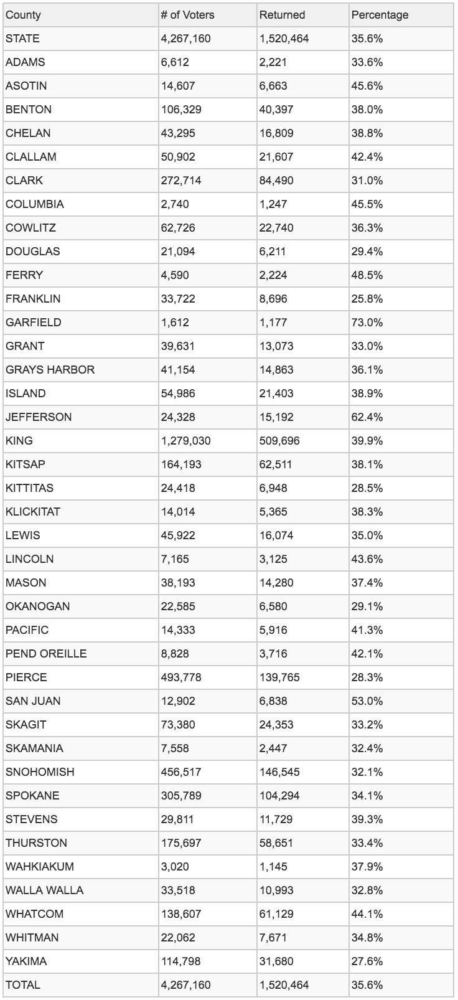

## Choose Your Politics (CYP)

Choose Your Politics, also known as CYP, was created with the sole pupose of fixing some of the problems we have in the     United States with electing governing officials. To attemp to fix some of the problems, CYP focuses on doing the following:

  * Focus on local state politics
  * Provide a reliable unbaised political feed for readers; reducing information feedback loops
  * Present fair-sided sources to avoid one-sided arguments
  * Encourage and create informed knowledgeable voters
  

**Supported** | **In development**
--- | ---
Utah | Washington

**Washington State 2017 General Election Voter Turnout by County**

**How CYP Works**

CYP works by scraping articles posted by reliable news sources. It takes these articles and analyzes them to determine if they are of value and importance and to who, to what, and where. From this information, CYP matches the article up with senators, house members, governers, ect. Then, after determining that the article has value and to who, what, and where, we run the article through social media platforms. We collect data from these platforms such as likes, shares, comments, mentions, and the rates at which they grow. Our algorithm, based on an extreamly simple version drawn from features of Facebooks early Edge Rank, can use the data we found with the article and the data we found when running the article through social media platforms to can create a score for that article in relation to the people, places, and orginizations that we found in the first step. This score constantly is changing with variables such as time depreatiation and the rise in popularity of the article on social media platforms. Using this score, we present articles for the people, places, orginizations, and ideas that the reader seeks more knowledge on. Eliminating the need to seek out informations, becuase the information is already curated in a simplistic, easy to use and read format.

---

## Sources by state
 
**Utah:**
 
**Supported** | **In development**
--- | ---
Deseret New | 
Fox 13 | 
House Democrats | 
KSL | 
KUTV | 
Senate Democrats | 
Senate Site | 
Salt Lake Tribune | 
St George | 
University of Utah Daily Chronicle | 
Utah Political Capital | 
Utah DataPoints | 
Utah Foundation | 
Utah Policy | 
Utah Representatives | 

**Washington:**

**Supported** | **In development**
--- | ---
None | None
